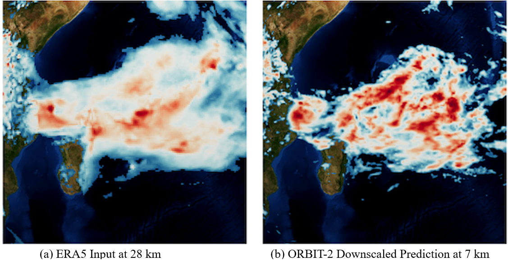
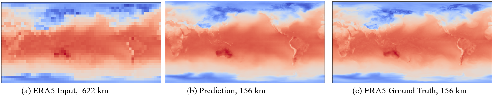
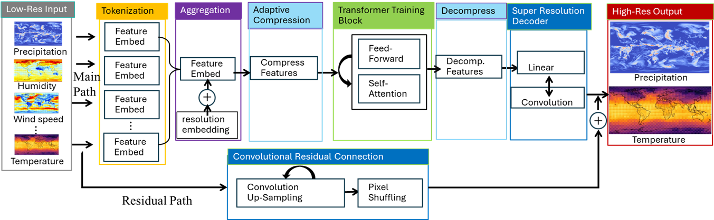
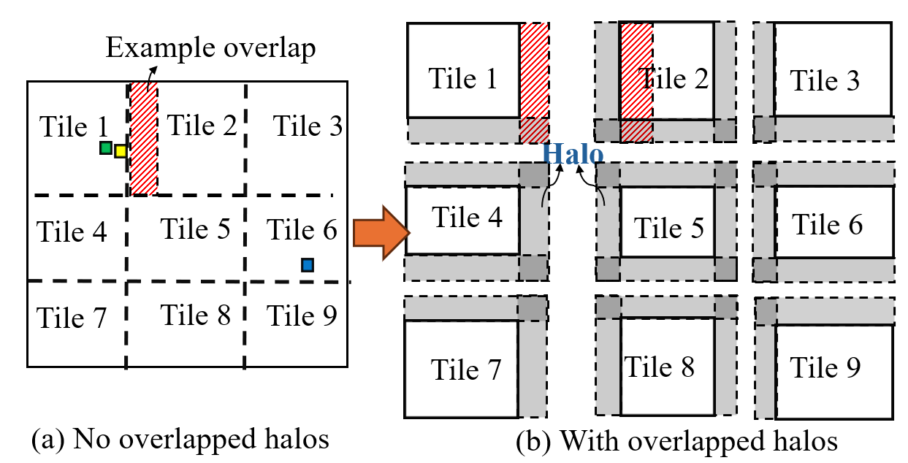
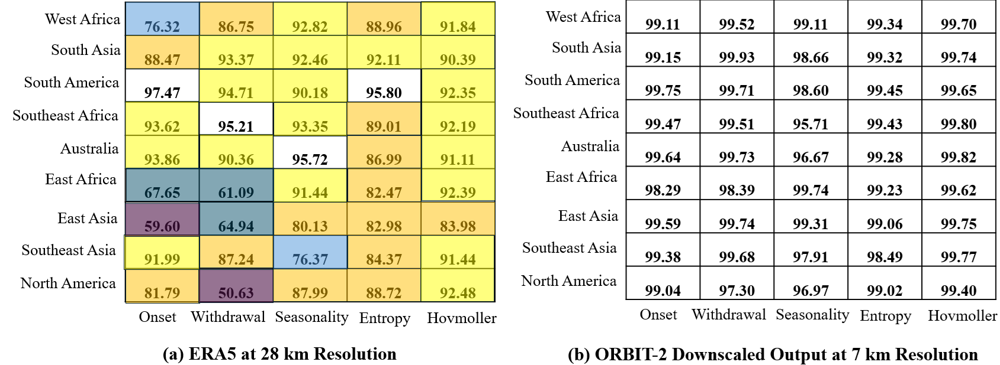

# ORBIT-2: Scaling Exascale Vision Foundation Models for Weather and Climate Downscaling

<div align="center">
  
</div>

<div align="center">
  
</div>

This repository contains code accompanying the paper [**ORBIT-2: Scaling Exascale Vision Foundation Models for Weather and Climate Downscaling**](https://arxiv.org/pdf/2505.04802).

## Overview
ORBIT-2 is a scalable foundation model for global, hyper-resolution climate downscaling. ORBIT-2 incorporates two key innovations:
 (1) Residual Slim ViT (Reslim), a lightweight architecture with residual learning and Bayesian regularization for efficient, robust prediction; and 
 (2) TILES, a tile-wise sequence scaling algorithm that reduces self-attention complexity from quadratic to linear, enabling long-sequence processing and massive parallelism. 
 ORBIT-2 scales to 10 billion parameters across 65,536 GPUs, achieving up to 4.1 ExaFLOPS sustained throughput and 74–98% strong scaling efficiency. It supports downscaling to 0.9 km global resolution and processes sequences up to 4.2 billion tokens. On 7 km resolution benchmarks, ORBIT-2 achieves high accuracy with 𝑅2 scores in range of 0.98–0.99 against observation data.

## Motivation
Conventional downscaling methods, such as dynamical approaches (nested climate models) and statistical approaches (regression-based mappings), are limited. Dynamical downscaling requires massive supercomputers and weeks of computation, while statistical methods often lack physical consistency and generalization across regions or variables. ORBIT-2 overcomes these challenges by combining physics-informed AI with exascale scalability, enabling global hyper-resolution downscaling in seconds rather than weeks. Once trained, ORBIT-2 runs efficiently even on modest hardware or edge devices, providing global downscaling in millisecond. In addition, ORBIT-2 provides a single, generalizable foundation model that delivers physically consistent, high-resolution climate predictions across diverse regions and variables—something conventional methods cannot achieve.

## Reslim Architecture
Reslim is a vision transformer (ViT) architecture that operates and trains directly on adaptively compressed spatial inputs, significantly reducing sequence length while preserving critical information. It preserves accuracy and reduces uncertainty through a lightweight residual learning architecture, enabling efficient, low-overhead predictions.

<div align="center">
  
</div>


## TILES Sequence Scaling Algorithm
TILES is a ViT training algorithm that reduces ViT's self-attention complexity from quadratic to linear. It works by dividing images into overlapping tiles, each processed in parallel on separate Graphical Process Units (GPUs) using localized self-attention. Each tile's downscaled outputs are then seamlessly merged to the full image.

<div align="center">
  
</div>


## Installation
In order to run the code, we provide the instructions below for creating a conda environment with the necessary packages. Follow the instructions according to the respective GPU type (AMD or NVIDIA) that you will be utilizing.

### Frontier (Systems with AMD GPUs)
```
conda create -n orbit python=3.11 -y
conda activate orbit
pip install torch==2.8.0+rocm6.4 torchvision==0.23.0 --index-url https://download.pytorch.org/whl/rocm6.4
pip install -U xformers==0.0.32 --index-url https://download.pytorch.org/whl/rocm6.4
MPICC="cc -shared" pip install --no-cache-dir --no-binary=mpi4py mpi4py
pip install -e .
```

### DGX (System with NVIDIA GPUs)
```
conda create -n orbit python=3.11 -y
conda activate orbit
pip install torch==2.8.0 torchvision==0.23.0 --index-url https://download.pytorch.org/whl/cu129
pip3 install -U xformers==0.0.32 --index-url https://download.pytorch.org/whl/cu129
conda install -c conda-forge mpi4py mpich
pip install -e .

```


## Tutorial Example

### Frontier
#### Prerequisites
- Access to Frontier supercomputer at ORNL
- Allocated compute hours
- Conda environment setup (see Installation section above)

#### Step 1: Configure Your Experiment
Choose an appropriate configuration file from `configs/`:
- `interm_8m.yaml`: 8M parameter model for testing
- `interm_117m.yaml`: 117M parameter model
- `interm_1b.yaml`: 1B parameter model
- `interm_10b.yaml`: 10B parameter model (requires more nodes)

**Important:** Before running, review and modify the config file for your needs. See the [Hyperparameter Configuration](#hyperparameter-configuration) section below for detailed explanations of all parameters.

Key settings for Frontier:

**GPU Configuration:**
```yaml
trainer:
  gpu_type: "amd"      # AMD GPUs on Frontier
```

**Parallelism Configuration:**
```yaml
parallelism:
  fsdp: 4              # Fully Sharded Data Parallel
  simple_ddp: 4        # Data Parallel
  tensor_par: 1        # Tensor parallelism
  seq_par: 1           # Sequence parallelism
# Note: fsdp × simple_ddp × tensor_par_ranks should equal total number of GPUs
```

**TILES Configuration (for very large images):**
```yaml
tiling:
  do_tiling: False     # Enable TILES for processing very large images/sequences
  div: 4               # Division factor: splits image into div×div tiles
                       # div=2 → 4 tiles (2×2), div=4 → 16 tiles (4×4)
  overlap: 3           # Number of pixel rows/columns to overlap between adjacent tiles
                       # Overlap ensures smooth reconstruction when stitching tiles
                       # Important: Total tile size must be divisible by patch_size
                       # If not, you'll get an error asking to adjust overlap
```

#### Step 2: Submit Training Job
First, edit `launch_intermediate.sh` to update:
- `#SBATCH -A` → your project allocation
- `conda activate` path → your conda environment
- `../configs/interm_8m.yaml` → your chosen config file (e.g., `interm_117m.yaml`, `interm_1b.yaml`)

Then submit the job:
```bash
cd examples/
sbatch launch_intermediate.sh
```

The script will:
- Load required modules (ROCm 6.3.1, libfabric, aws-ofi-rccl)
- Set up environment variables for optimal AMD GPU performance
- Launch training with 8 GPUs per node
- Output logs to `flash-{JOBID}.out`

#### Step 3: Monitor Training
```bash
# Check job status
squeue -u $USER

# Monitor training progress
tail -f flash-{JOBID}.out
```

Key log indicators:
- Epoch progress and loss values
- GPU memory usage per rank
- Training throughput (samples/sec)
- Checkpoint save confirmations

#### Step 4: Visualize Results
After training completes or reaches a checkpoint, edit `launch_visualize.sh` to update:
- `#SBATCH -A` → your project allocation
- `conda activate` path → your conda environment
- `../configs/interm_8m_ft.yaml` → your config file

For visualization, you have two options to specify the checkpoint:

**Option 1: Using config file (default)**
```yaml
trainer:
  pretrain: /path/to/your/checkpoint.ckpt  # Path to trained model checkpoint
```

**Option 2: Using command line argument (overrides config)**
```bash
# Edit launch_visualize.sh to add --checkpoint argument:
python ./visualize.py ../configs/interm_8m_ft.yaml --checkpoint /path/to/custom/checkpoint.ckpt
```

Then submit the visualization job:
```bash
sbatch launch_visualize.sh
```

This will generate visualization outputs for:
- Input low-resolution data
- ORBIT-2 downscaled predictions at high resolution
- Comparison metrics

Additional visualization options:
- `--checkpoint PATH`: Override checkpoint path from config file

### DGX
1. Modify your [CONFIG_FILE] making sure that fsdp x simple_ddp x tensor_par_ranks = [NUM_GPUS]
- Several Example config files are available in the `configs` folder
2. Set gpu_type to `nvidia` in your config file
3. Enter the examples directory
4. Run the the training script with `mpirun -n [NUM_GPUS] python -u intermediate_downscaling.py [CONFIG_FILE] MPI` 


## Hyperparameter Configuration
To run the examples in the previous section we use a YAML config file to encapsulate all of the different available options for the model and training. Below is a description of the different available options.

- `max_epochs`: Int.
Number of epochs to be done before the training script ends. 

- `checkpoint`: Str.
Checkpoint file to use for continued training of a model. Expects the same configuration setting as the previously trained model. Starts at the epoch where the previous model stopped training.

- `pretrain`: Str.
Checkpoint file to use as a pretrained state for the model. Use this when training configurations such as data_type and amount of GPUs is changed.

- `batch_size`: Int.
Per GPU batch size.

- `buffer_size`: Int.
The size the dataloader buffer is to reach before batches are served to the training loop.

- `num_workers`: Int.
Number of data loader workers.

- `data_type`: Str (float32, bfloat16).
Data type to be used during training.

- `gpu_type`: Str (amd, nvidia).
Type of GPU being use for training.

- `train_loss`: Str (various options avaiable check `src/climate_learn/metrics`).
Loss function to use during training.

- `fsdp`: Int.
Number of Fully Sharded Data Parallel ranks to use, for sharding model states.

- `simple_ddp`: Int.
Number of Data Parallel ranks to use, for distributing different data to ranks.

- `tensor_par`: Int.
Number of Tensor Parallel ranks to use, for distributing tensor across multiple ranks.

- `do_tiling`: Bool.
Whether to perform tiling of the input data.

- `div`: Int.
Number of tiles to divide the x and y dimensions of the data into, e.g if data is (180,90) and div=2, each image is split into 2x2=4 (90,45) tiles.

- `overlap`: Int.
Number of pixel rows/columns to overlap between adjacent tiles in the TILES algorithm. Overlap regions ensure smooth reconstruction when tiles are stitched back together. Note: Due to the 2:1 aspect ratio of climate data (longitude:latitude), the actual horizontal overlap is 2x the vertical overlap


- `lr`: Float.
Initial learning rate for the optimizer.

- `weight_decay`: Float.
Weight decay for the Adam optimizer.

- `beta_1,beta_2`: Float.
Beta coefficients for the Adam optimizer.

- `warmup_epochs`: Int.
Number of warmup epochs for learnining rate scheduler.

- `warmup_start_lr`: Float.
Learning rate to use for warm up.

- `eta_min`: Float.
Coefficient for linear warmup cosine annealing

- `supperres_mag`: Int.
Scale to magnify the input data to, if supperres_mag=4 and data is (180,90) output will be (720,360).

- `cnn_ratio`: Int.
How to scale the size of the output for the convolutional neural network skip connection
**To Do: Xiao, more detailed description**

- `patch_size`: Int.  
Size of patches. Input data must be divisible by `patch_size`.

- `embed_dim`: Int.  
Embedding dimension for Transformer Inputs

- `depth`: Int.
Number of Transformer blocks.

- `decoder_depth`: Int.
Number of MLP blocks to use in the decoder.

- `num_heads`: Int.  
Number of heads in Multi-head Attention layer.

- `mlp_ratio`: Int.
Ratio of MLP hidden dimension to embedding dimension, used to set the dimension of the MLP (FeedForward) layer.

- `drop_path_rate`: Float (0,1).
Stochastic depth dropout rate for dropping random layers during training.

- `drop_rate`: Float (0,1).
Stochastic dropout rate for dropping random values from attention input in transformer computations.

- `low_res_dir`: Dictionary of Str.
Dictionary with each entry containing folder locations for files corresponding to different dataset's low resolution data. 

- `high_res_dir`: Dictionary of Str.
Dictionary with each entry containing folder locations for files corresponding to different dataset's high resolution data. 

- `spatial_resolution`: Dictionary of Int. 
Dictionary with each entry containing spatial resolution information corresponding to the data used in `low_res_dir` 

- `default_vars`: List[str].
List of different potential modalities to be used as input. This list contains the available input channels.

- `dict_in_variables`: Dictionary of Lists of Str.
Variables corresponding to the different channels used as input data for the model training.

- `dict_out_variables`: Dictionary of Lists of Str.
Variables corresponding to the different channels in the output dataset that will be used as targets from the high resolution dataset for model prediction.


## Datsets and Model Checkpoints
Training dataset and its usage description can be found at [Constellation Data Storage Archive](https://doi.ccs.ornl.gov/dataset/e4c2db1f-e88c-5ad0-bb96-59be0ef7c772).

## Pretraining and Fine-Tuning Datasets on Frontier
See Table 1 of the orbit-2 paper at [ORBIT-2 Paper on arXiv](https://arxiv.org/pdf/2505.04802) , for datasets trained for checkpoints

## Performance
### Strong Scaling on Frontier

<div align="center">
  
</div>


### Maximum Sequence Length Scaling
See Table 3 of the paper. ORBIT-2 uses Reslim architecture and TILES sequence scaling algorithm to scale up to 4.2 billion token sequence length.


### Model Inference Speed
See Table 5 of the paper. A key advantage of AI foundation models is their efficiency at inference. Once trained, they can be deployed on edge devices with limited resources and deliver near real-time predictions. We evaluate inference performance on 8 GPUs, using ERA5 to ERA5 downscaling from 112 km to 28 km. For the 9.5M-parameter model, downscaling each global sample requires only 4 millisecond. For the 10B-parameter model, it takes 0.55 second. In contrast, dynamic numerical downscaling approaches require days or weeks of computation on a large supercomputer. This highlights the unmatched prediction speed of AI, enabling deployment in resource-limited environments with near real-time performance.


### Downscaling Accuracy
See Table 6 for both U.S. regional and global downscaling accuracy. On 7 km resolution benchmarks, ORBIT-2 achieves high accuracy with 𝑅2 scores in range of 0.98–0.99 against observation data. 

### Climate Analysis
ORBIT-2 achieves high-fidelity precipitation downscaling (1998–2021) across 58 IPCC climate regions. Key metrics include R² correlation, SSIM, monsoon onset/withdrawal timing, precipitation seasonality, entropy, and Hovmöller diagnostics. The figure on the left shows ERA5 at 28 km resolution, exhibiting moderate skill scores across metrics and regions, whereas ORBIT-2 7 km downscaling (figure on the right) consistently achieves much higher skill scores across all metrics and monsoon regions. These results highlight the effectiveness of ORBIT-2 in enhancing the spatiotemporal fidelity of precipitation, especially in regions governed by complex climatic processes.

<div align="center">
  
</div>


### Animation
ERA5 input at 28km and ORBIT-2 downscaled output at 7km for global precipitation.
[ORBIT-2 animation](https://www.youtube.com/watch?v=Iahsl1L_1jQ)


### Citation
If you use ORBIT-2 in your research, please cite both the software and the paper:

```bibtex 
@software{Wang_ORBIT-2_Scaling_Exascale,
  author       = {Wang, Xiao and Choi, Jong-Youl and Lyngaas, Isaac and Yoon, Hong-Jun 
                  and Aji, Ashwin and Kurihana, Takuya and Fan, Ming and Balaprakash, Prasanna 
                  and Lu, Dan},
  title        = {ORBIT-2 Weather and Climate Downscaling Software Repository},
  url          = {https://github.com/XiaoWang-Github/ORBIT-2}
}
```

```bibtex
@misc{wang2025orbit2scalingexascalevision,
  title         = {ORBIT-2: Scaling Exascale Vision Foundation Models for Weather and Climate Downscaling}, 
  author        = {Xiao Wang and Jong-Youl Choi and Takuya Kurihaya and Isaac Lyngaas and Hong-Jun Yoon 
                   and Xi Xiao and David Pugmire and Ming Fan and Nasik M. Nafi and Aristeidis Tsaris 
                   and Ashwin M. Aji and Maliha Hossain and Mohamed Wahib and Dali Wang and Peter Thornton 
                   and Prasanna Balaprakash and Moetasim Ashfaq and Dan Lu},
  year          = {2025},
  eprint        = {2505.04802},
  archivePrefix = {arXiv},
  primaryClass  = {cs.LG},
  url           = {https://arxiv.org/abs/2505.04802}
} 
```
